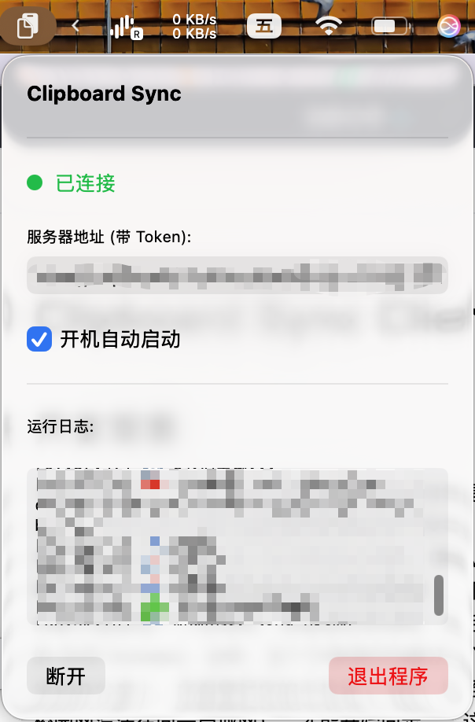
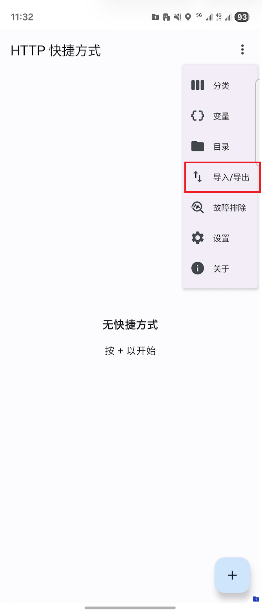
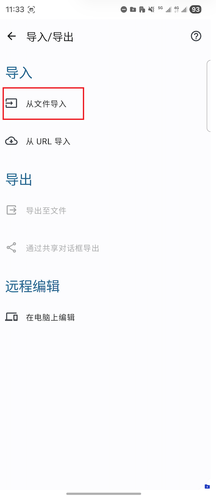
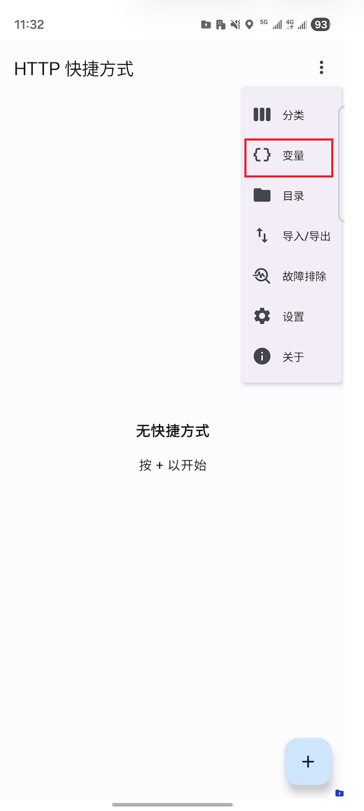
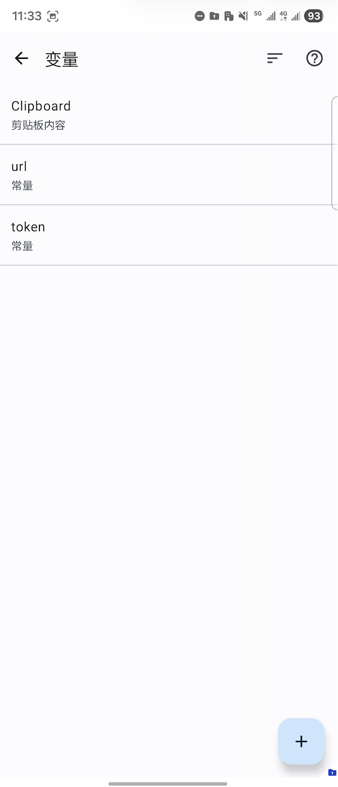
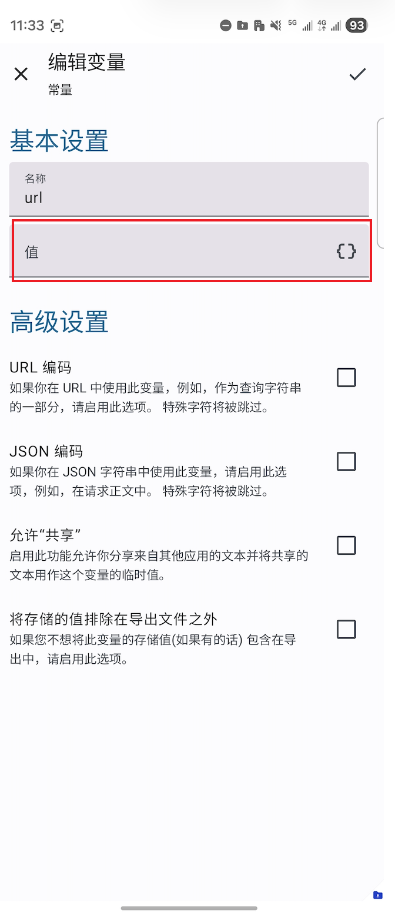

# Clipboard Sync Client

## 开发背景
当前的情况下，市面上最方便的剪贴板同步自然是各家的自有生态，这也注定了跨平台的剪贴板同步并不友好。假如您像作者一样，有一台 Mac 和一台 Android 手机 **（特么的 iPhone 17 Pro 丑爆了！！！完全没有买它的任何欲望）**，那么当前最优的解可能是造一个局域网，或者虚拟局域网，然后用着 UI 过时的 KDE Connect。当然，这个方案很好地解决了问题，但每次坐到办公桌上，你都要把你的手机连上 WiFi（甚至我们学校的校园网没法在同一局域网），才能开始同步——这实在是太蠢了。因此，萌生了开发一个公网剪贴板同步服务的想法。

## 这是什么？
这是一个基于 Cloudflare Wrangler 的剪贴板同步服务（**在此跪谢为了人类科技而慷慨解囊的赛博菩萨 Cloudflare，那是一家伟大无需多言的公司**），通过它的中转，你无需将你的 Mac 和 Android 置于同一局域网内，也能实现公网剪贴板的同步。基于 Cloudflare 伟大的慷慨，您就算挥霍，也基本不会产生什么费用。

## 如何使用？
### macOS
请从[Releases](https://github.com/KynixInHK/clipboard-sync-client/releases)下载最新的 `.dmg` 文件，然后正常安装应用即可。

> NOTICE：macOS 端的客户端是一个纯粹的“任务栏应用”，启动后不会有任何窗口弹出，您可以在右上角找到它的图标。

在右上角的菜单中，输入您的 server 地址（如**https://clipboard-sync.YOUR_NAME.workers.dev?token=123456**），然后点击“连接”即可开始连接，连接成功后，左上角会显示“已连接”，代表您的剪贴板同步服务已经启动。

### Android
由于 Android 10+ 开始的安全限制，剪贴板的读取需要一个前台服务，我已经穷尽了所有的办法来开发静默运行的剪贴板同步应用，但都以失败告终。（**Fuck you Android !!!**）

因此，我们完全摒弃了“开发一个应用”的想法，转而使用 [HTTP Shortcuts](https://github.com/Waboodoo/HTTP-Shortcuts)，我们在 [Releases](https://github.com/KynixInHK/clipboard-sync-client/releases) 中为你准备好了快捷方式的文件，你可以按照如下的步骤导入它们：

而后你只需要在点击主页上的“同步到Mac”或“同步自Mac”即可将剪贴板内容从Android同步到Mac或从Mac同步到Android。

如果你碰巧还是三星手机，那恭喜你，你可以把这两个快捷方式绑定到**One Hand Operation+**，你就可以获得一个随时随地上传下载同步剪贴板的东西了。
